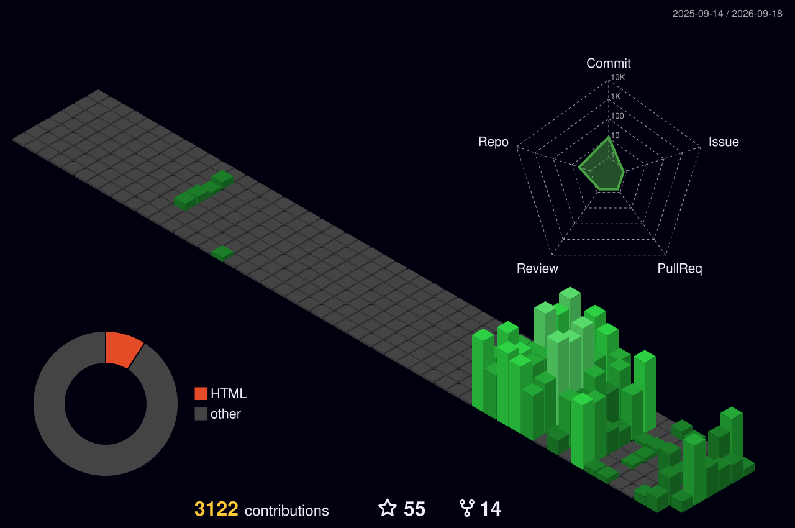

<!-- ═══════════════════════ ANIMATED HEADER ═══════════════════════ -->


<!-- ═══════════════════════ TYPING ANIMATION ══════════════════════ -->
<div align="center">
  <a href="https://github.com/prinsharma1999">
    
  </a>
</div>

<!-- ═══════════════════════ BADGES ═══════════════════════ -->
<div align="center">
  
  <a href="https://github.com/prinsharma1999?tab=followers">
    
  </a>
  <a href="https://cipher.academy">
    
  </a>
</div>

<br />

<!-- ═══════════════════════ SOCIALS ═══════════════════════ -->
<div align="center">
  <a href="mailto:prin@cipher.academy">
    
  </a>
  <a href="https://cipher.academy" target="_blank">
    
  </a>
  <a href="https://twitter.com/fuxksniper" target="_blank">
    
  </a>
  <a href="https://t.me/prindead" target="_blank">
    
  </a>
</div>

<br />

<!-- ═══════════════════════ WHOAMI ═══════════════════════ -->
##  `whoami`

```yaml
name:        Prin Sharma
role:        Bug Bounty Hunter · Security Researcher
building:    Cipher Academy  →  https://cipher.academy
location:    India 🇮🇳
focus:       Web & Mobile Application Pentesting
also:        Full-stack engineering — TypeScript, Python, React, FastAPI
reach_me:    prin@cipher.academy
motto:       "Break it. Report it. Fix it."
```

<br />

<!-- ═══════════════════════ CIPHER ACADEMY ═══════════════════════ -->
## 🏛️ Cipher Academy

<div align="center">
  <a href="https://cipher.academy">
    
  </a>
</div>

<br />

<!-- ═══════════════════════ ARSENAL ═══════════════════════ -->
## ⚔️ Arsenal

<div align="center">

**Languages**


**Frontend**


**Backend & Data**


**Security & Reverse Engineering**


**DevOps & Testing**


**Bug Bounty Platforms**


</div>

<br />

<!-- ═══════════════════════ STREAK ═══════════════════════ -->
## 🔥 Streak

<div align="center">
  
</div>

<br />

<!-- ═══════════════════════ ACTIVITY GRAPH ═══════════════════════ -->
## 📈 Contribution Activity

<div align="center">
  
</div>

<br />

<!-- ═══════════════════════ 3D CONTRIBUTIONS ═══════════════════════ -->
## 🧊 Contributions in 3D

<div align="center">
  
</div>

<br />

<!-- ═══════════════════════ SNAKE ═══════════════════════ -->
## 🐍 Watch the Snake Eat My Contributions

<div align="center">
  <picture>
    <source media="(prefers-color-scheme: dark)" srcset="https://raw.githubusercontent.com/prinsharma1999/prinsharma1999/output/github-snake-dark.svg" />
    <source media="(prefers-color-scheme: light)" srcset="https://raw.githubusercontent.com/prinsharma1999/prinsharma1999/output/github-snake.svg" />
    
  </picture>
</div>

<br />

<!-- ═══════════════════════ FOOTER ═══════════════════════ -->
<div align="center">
  <i>⭐ Both graphs above regenerate themselves daily via GitHub Actions.</i>
</div>


