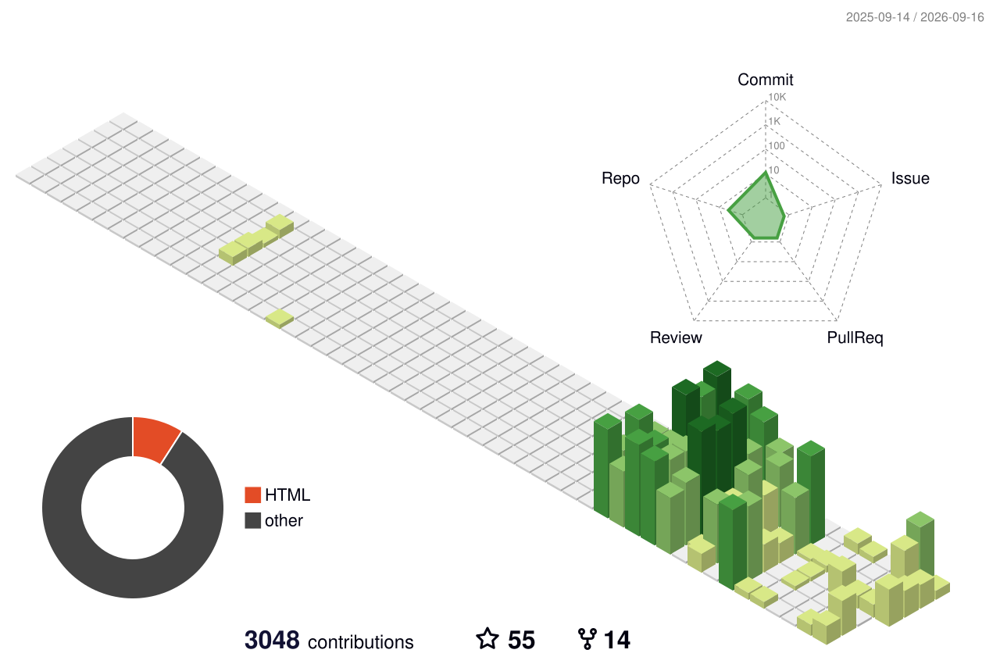

<h3 align="center">A bug bounty Hunter from India</h3>

  

- 🔭 I’m currently working on **Bug bounty Hunting**

- 🌱 I’m currently learning **Web application pentesting**

- 👯 I’m looking to collaborate on **Bug bounty**

- 🤝 I’m looking for help with **Nothing 😅**

- 💬 Ask me about **Anything you want**

- 📫 How to reach me **prindevil30@gmail.com**

- ⚡ Fun fact **🙃**

  

&nbsp;

 

<h3 align="center">📊 My Contributions in 3D</h3>

  

